# pussycats - Cat Tinder

An app for searching cat photos and learning about breeds.  
[Download APK](https://github.com/lzkgmr/cat_tinder/releases/download/v0.0.meow/app-release.apk)

## What's in the app?
### you can see hw2 updates below

### 1. Pretty icon and funny loading animation with cats>
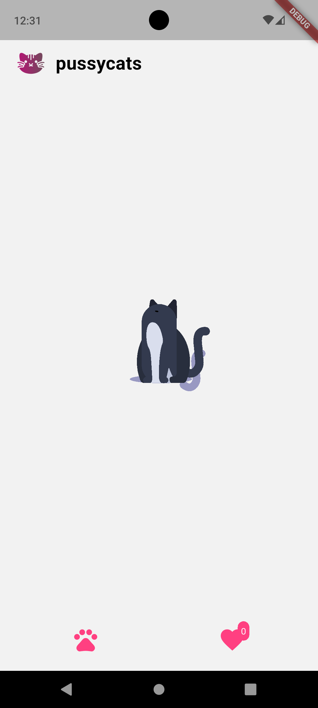 

### 2. Tinder mechanics
Tinder mechanics with cat selection. Information is loaded from `TheCatAPI.com`. There are lots of cat photos.

User can **swipe right and left** or **use buttons**. If user likes the cat, he can mark it and likes counter will increase. 

Btw, UI is fine on big and small phones.

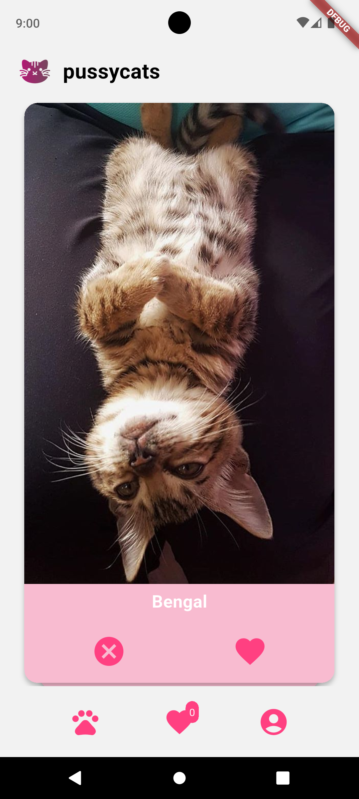 

### 3. Breed list
If user taps on `Pow Button` on main screen, he will see **Breed list**. 

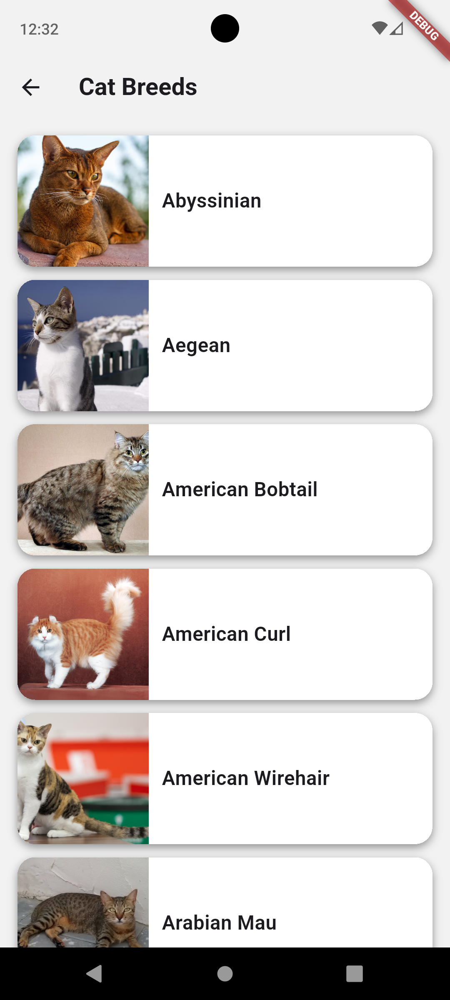

### 4. Liked cats screen
If user taps on `Heart Button` on main screen, he will see **Liked cats**.
Breeds in this list are unique. User can *open details*, *remove particular cat* or *clean all of them*. Like counter on the main screen will update. 

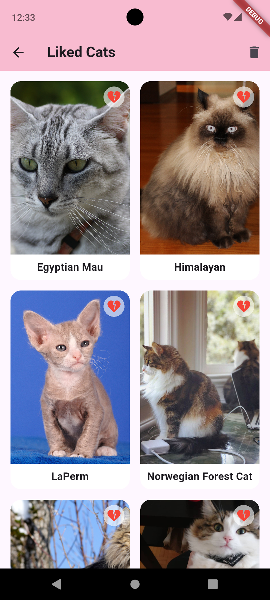 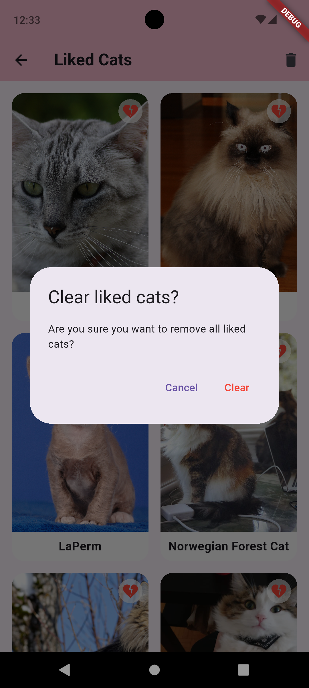 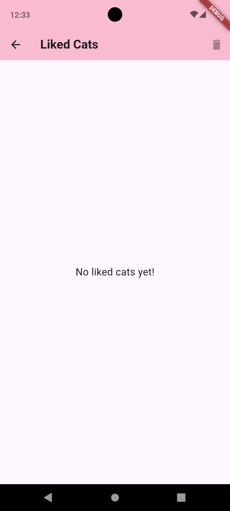

### 5. Breed details.
User can open breed details from the `main screen` (tap to picture of the cat), from the `breed list` and from the `liked cats`.
There is an information about breed:
1. Picture 
2. Temperament
3. Origin
4. Short description
5. Adaptability (5-point scale)
6. Intelligence
7. Life span
8. Weight (metric)

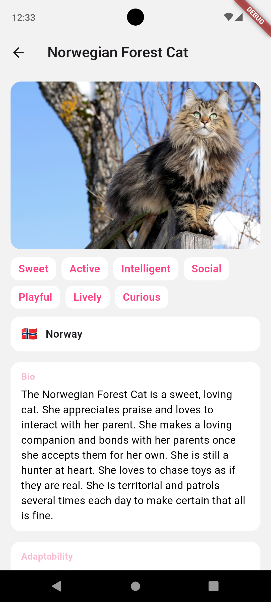 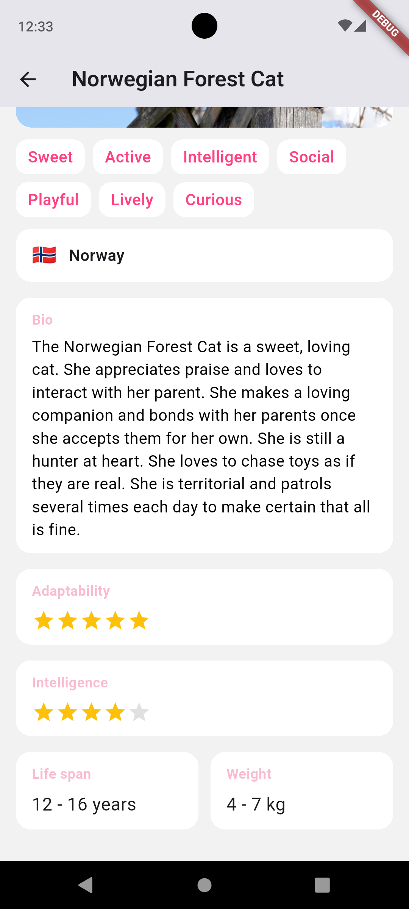 

### Some important details 
- The list of liked cats and their number is saved between app launches.
- All functional requirements are met.
- An additional feature has been implemented: a list of liked cats.
- Design of the app is adorable.
- The code is formatted using `dart format`.
- `flutter_lints` is enabled and used (2 rules).
- The flutter analyze command runs successfully.
- The `http package` and `TheCatApi.com' were used.
- The `Image` and `CachedNetworkImage` widget is used to display images.

### 6. Onboarding
User can see short info about app features before he sign up. It shows only once and user can skip it. There is animated logo during swiping.
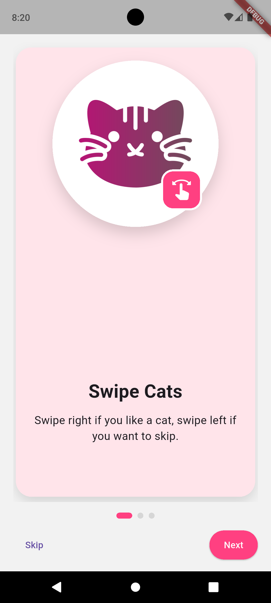 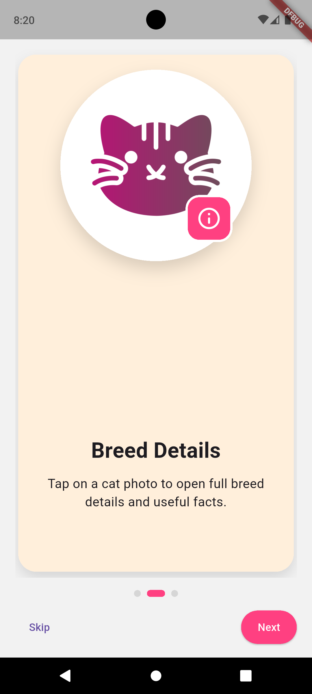  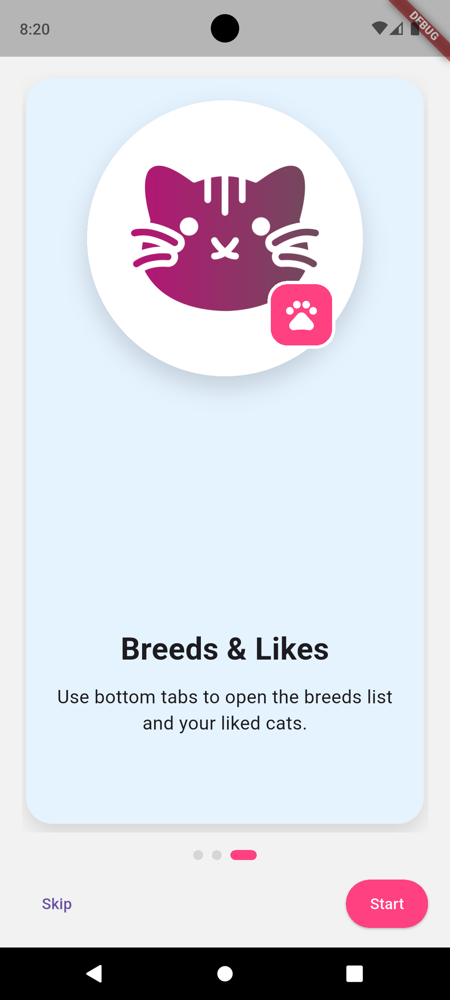

### 7. Registration and sign in
User can register a new account with email and password (Firebase Auth), sign in exicting account and log out in profile.
If user inputs incorrect or invalid data, he sees an error.
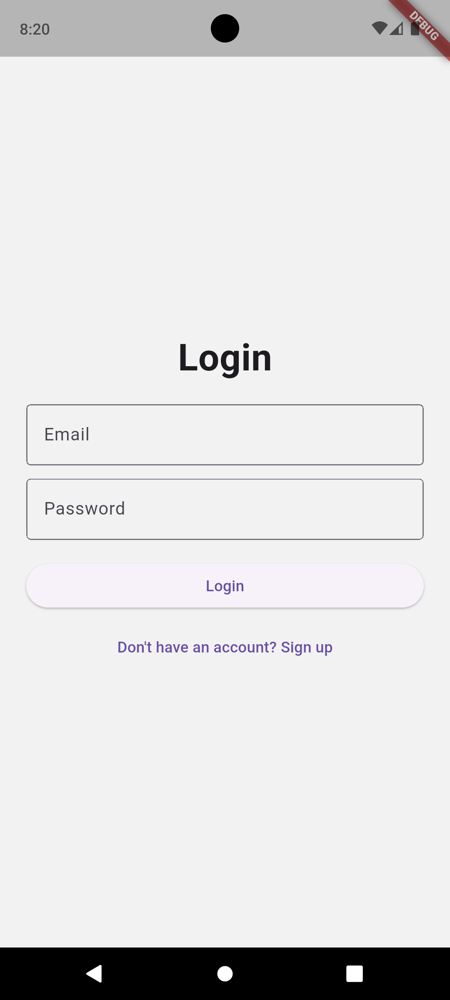 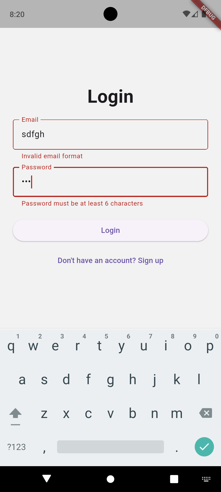  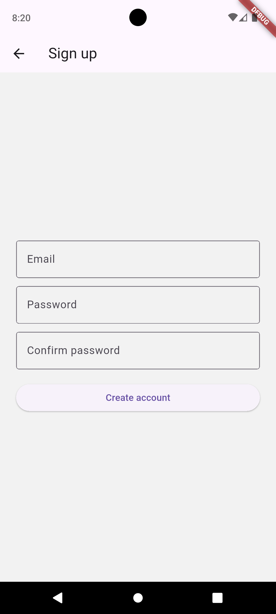

### Something more in this project
- Clean Architecture
- Unit-tests
- Widjet-tests
- CI/CD
- Firebase Analytics
